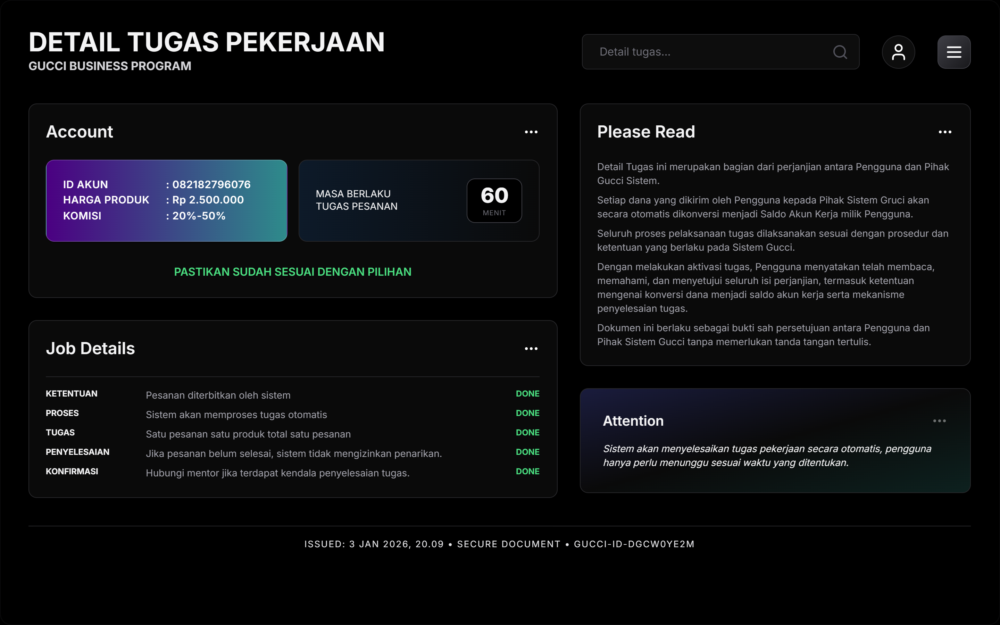

# Run and deploy your  app

This contains everything you need to run your app locally.

## Run Locally

**Prerequisites:**  Node.js

1. Install dependencies:
   `npm install`
2. Set the `PI_KEY` in [.env.local](App.tsx) to your API key
3. Run the app:
   `npm run dev`
